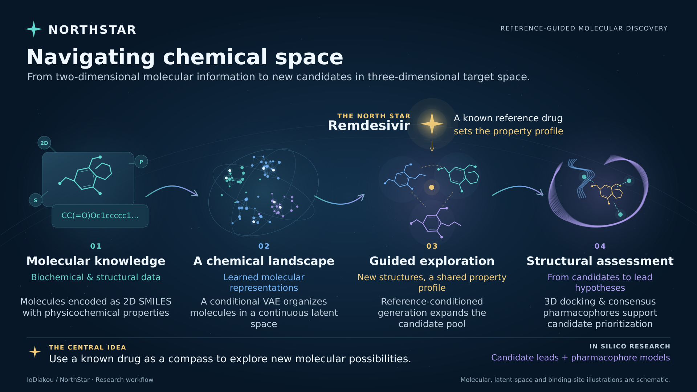

# NorthStar

### Navigating chemical space through reference-guided molecular generation

NorthStar is a computational research pipeline that connects molecular information encoded as **SMILES** with deep generative learning and structure-based assessment. A **conditional variational autoencoder (CVAE)** learns molecular representations and generates candidate structures conditioned on a chosen physicochemical property profile. Molecular docking and consensus pharmacophore analysis form the downstream assessment workflow.

Developed as part of doctoral research, NorthStar explores a central question:

> Can a known drug act as a compass for discovering new molecular structures with a desired property profile?



*Conceptual overview. Molecular structures, latent-space constellations, and binding-site illustrations are schematic.*

## The idea

Public chemical databases contain extensive molecular information in compact, machine-readable forms. SMILES represents molecular connectivity as a string, making it possible to learn from chemical structures using sequence models.

NorthStar pairs these strings with physicochemical descriptors and trains a CVAE to learn a continuous latent representation of molecular space. A reference drug—the **North Star**—provides the property profile used to condition generation.

The aim is to explore new structures with reference-like properties. Generated structures are computational candidates: their biological activity, safety, and suitability for development require further evaluation.

## Research workflow

### 1. Represent molecular knowledge

Chemical structures are represented as SMILES and paired with calculated descriptors:

- **Molecular weight:** exact molecular weight calculated with RDKit.
- **Lipophilicity:** calculated logP.
- **Polarity:** topological polar surface area (TPSA).

The research workflow combines the **ZINC 250K dataset** with an **in-house dataset of viral polymerase inhibitors** assembled from public molecular databases.

### 2. Learn the chemical landscape

A conditional variational autoencoder learns from molecular strings and their properties. Its LSTM encoder maps the input to a latent distribution, and its LSTM decoder reconstructs molecular sequences using the latent representation and property conditions.

Training combines a sequence reconstruction objective with a Kullback–Leibler regularization term. Together, these objectives support a continuous latent space from which molecular sequences can be generated.

### 3. Generate candidates using a reference profile

The generation script samples latent vectors from a normal distribution and supplies a target property vector to the decoder. The reference profile guides generation through **property conditioning**; the published script does not explicitly sample around the encoded coordinates of a reference molecule.

Generated sequences are converted to SMILES, RDKit retains valid nonempty molecular structures, and duplicates are removed after canonicalization. The output includes SMILES and recalculated molecular descriptors.

### 4. Assess molecular interactions

The broader research workflow evaluates generated candidates through **molecular docking** in the target enzyme’s binding site and **consensus pharmacophore analysis**. These steps support the investigation of binding poses and shared interaction features for candidate prioritization.

Docking and pharmacophore analysis are shown in the research workflow; their execution scripts are not currently included in this repository.

## The North Star: Remdesivir

In the presented research, **Remdesivir** serves as the reference drug for an antiviral application focused on **RNA-dependent RNA polymerase (RdRp)**.

The reference provides a physicochemical profile for exploring alternative molecular structures. The resulting candidates can be viewed as *constellations*: new molecular possibilities organized around a guiding property profile.

Similarity in these properties does not, by itself, establish equivalent target binding or biological activity. Structural diversity and novelty also need to be measured independently.

## Model architecture

The implementation uses recurrent sequence models for both encoding and decoding.

| Component | Configuration in the supplied scripts |
| --- | --- |
| Generative model | Conditional variational autoencoder |
| Encoder | 3 LSTM layers, 512 units per layer |
| Decoder | 3 LSTM layers, 512 units per layer |
| Latent representation | 200 dimensions |
| Property conditions | Molecular weight, logP, TPSA |
| Maximum sequence length | 120 tokens, including sequence handling |
| Training objective | Reconstruction loss + KL regularization |
| Optimizer | Adam |

*Values reflect the default configuration. Settings are exposed through command-line arguments; decoder state depth follows the configured layer count.*


## Structural assessment illustration

The original research overview presents two candidate molecules positioned within the target enzyme’s binding pocket.


*Illustration of the structure-based assessment stage. Binding poses alone do not establish experimental activity.*

## Repository guide

| File | Purpose |
| --- | --- |
| `core_architecture.py` | CVAE definition, encoder, decoder, losses, and sampling methods |
| `core_train.py` | Training loop, held-out loss evaluation, and checkpoint saving |
| `constellating.py` | Property-conditioned generation and candidate export |
| `prop_calc_module_basis.py` | RDKit descriptor calculation from SMILES |
| `utils.py` | Sequence preparation and molecular representation utilities |
| `gpu-test.py` | GPU diagnostic script |
| `test.py` | Legacy data preparation utility that extracts alternating input lines |
| `run_tests.py` | Regression test runner; add `--model` for TensorFlow integration tests |
| `legacy_utils.py` | Archived helpers for older model interfaces |

## Getting started

The scripts support descriptor preparation, model training, and candidate generation.
Research datasets, trained checkpoints, and downstream docking/pharmacophore
protocols are not included.

### Installation

Use Python 3.11 in a fresh virtual environment:

```bash
python3.11 -m venv .venv
source .venv/bin/activate
python -m pip install -r requirements-lock.txt
```

The lockfile targets a Linux x86_64 CPU environment with TensorFlow 2.15,
TensorFlow Addons 0.23, and RDKit. Direct dependencies are listed in
`requirements.txt`.

On Windows, create the environment with `py -3.11 -m venv .venv` and activate it
with `.venv\Scripts\Activate.ps1` in PowerShell. Platform-specific dependency
adjustments may be needed.

### Try a small example

```bash
python prop_calc_module_basis.py --input_filename examples/smiles.txt --output_filename examples/smiles_prop.tsv
python core_train.py --prop_file examples/smiles_prop.tsv --save_dir runs/demo --num_epochs 1 --batch_size 7 --latent_size 24 --unit_size 8 --n_rnn_layer 2 --seq_length 32
python constellating.py --save_file runs/demo --target_prop "46 0 20" --batch_size 1 --num_iteration 10 --result_filename runs/demo/candidates.tsv
```

Use a new output directory and result filename for each run.

The fixture molecules and target values demonstrate the software interface;
they are not a research dataset or a Remdesivir reference profile. A tiny model
trained for one epoch may produce no valid candidates.

### Data and saved outputs

Descriptor preparation accepts one SMILES string per line and writes a
headerless, tab-separated file in the order **SMILES, MW, logP, TPSA**. The model
uses raw descriptors without normalization.

Training saves checkpoints, vocabulary, architecture settings, source-data hash,
retained source-line mapping, split indices, and loss history. Generation reads
the checkpoint's metadata sidecar and exports canonical, unique molecules with
recalculated descriptors plus a statistics JSON. It requires no training dataset
when saved metadata is available.

### Checkpoints without metadata

For a checkpoint without a metadata sidecar, provide the exact training property
file used to construct its vocabulary:

```bash
python constellating.py --save_file path/to/checkpoint-prefix --legacy_checkpoint --prop_file path/to/training-properties.txt --target_prop "46 0 20" --result_filename candidates.tsv
```

Use the checkpoint prefix without `.index` or `.data-*` extensions. Supply
`--latent_size`, `--unit_size`, `--n_rnn_layer`, and `--seq_length` if the trained
model differs from the defaults. Vocabulary identity depends on the original
training file; matching tensor shapes alone cannot verify it.

### Tests

```bash
python run_tests.py
python run_tests.py --model
```

The first command runs the data and helper tests. The second additionally runs
TensorFlow training, generation, and checkpoint-compatibility tests on a host
that supports TensorFlow sessions.

## Scope and interpretation

NorthStar supports **computational hypothesis generation and candidate prioritization**. Molecular generation does not imply chemical synthesis, and RDKit parsing checks do not establish synthetic accessibility. Shared physicochemical properties do not guarantee shared pharmacological effects.

The conceptual workflow includes downstream structural assessment, while the published Python implementation focuses on data preparation, CVAE training, and molecular generation. Quantitative claims about novelty, diversity, binding performance, or experimental efficacy should be supported by the corresponding evaluation data.

## Project and contact

NorthStar was developed as part of doctoral research. For questions about the research, datasets, or associated publications, contact the maintainer through the [GitHub repository](https://github.com/IoDiakou/NorthStar).
